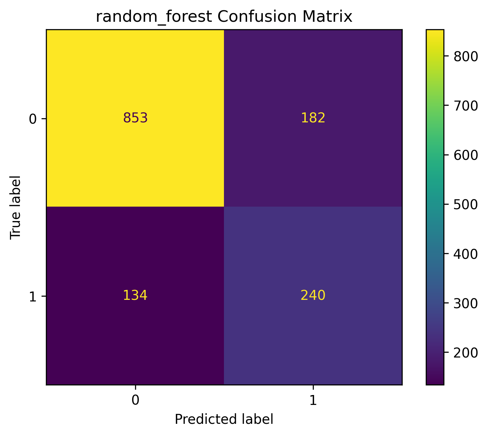
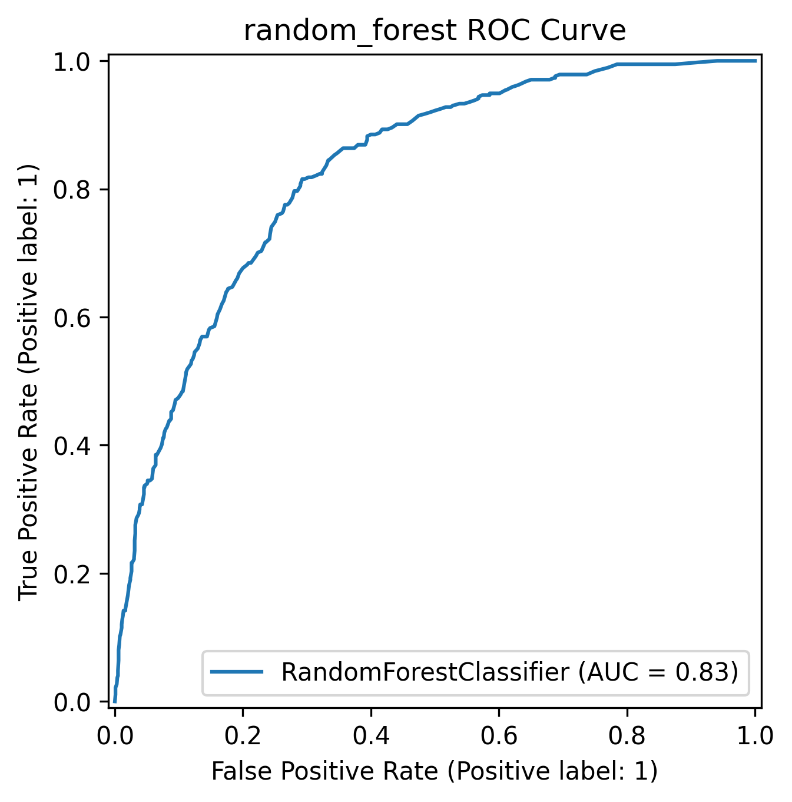
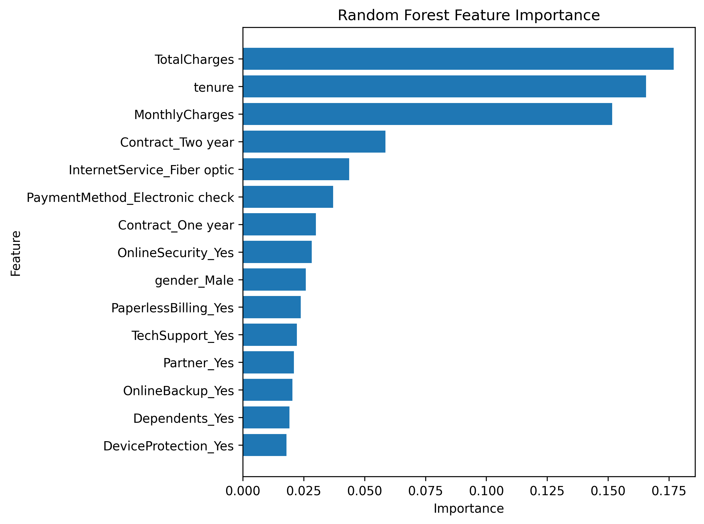
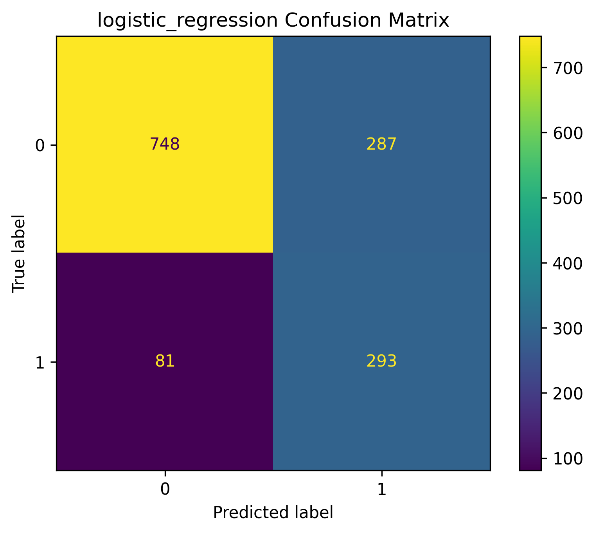
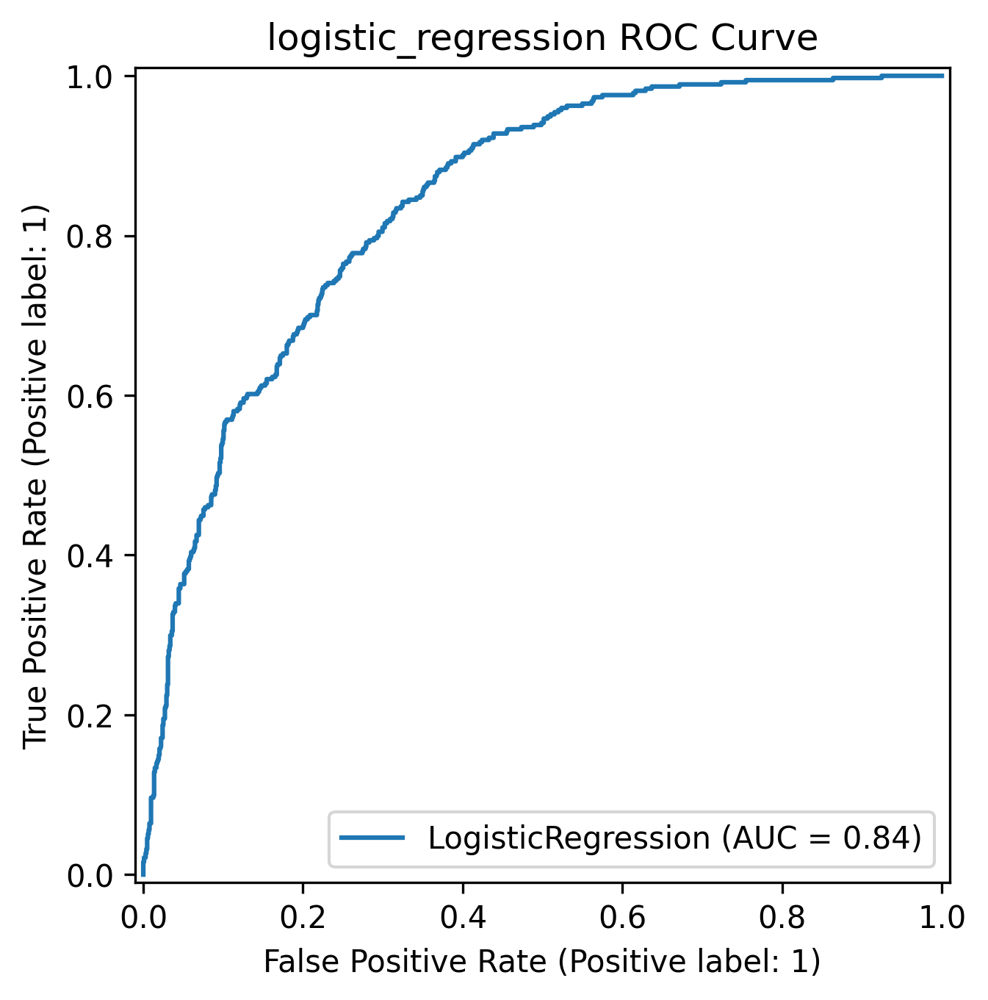

# Telecom Customer Churn Project

This is my student project about Customer Churn in a telecom company. 

"Churn" means customers stop using the company's service. My goal is to find out **why** they leave. I also build simple AI models to guess who will leave next. This helps the company keep their customers happy.

## Project Folders

* `dashboard/`: Contains my Power BI file (`BI_prj.pbix`) and pictures.
* `data/`: My raw data and clean data files.
* `src/`: My Python code.
  * `data_loader.py`: Open data and fix missing parts.
  * `eda.py`: Make charts to understand the data.
  * `preprocessing.py`: Get the data ready for the AI model.
  * `models.py`: Train the Machine Learning models.
  * `evaluation.py`: Check if the models are good and save pictures.
  * `main.py`: Run all the code.
* `outputs/`: Saved pictures, charts, and results.
  * `figures/`: Confusion Matrices, ROC curves, and other charts.
  * `models/`: CSV files with my results (`cv_results.csv`, etc.).

## Business Questions & Power BI

I also made a Power BI Dashboard. It helps managers see the data easily. 

*(Upload an image of your dashboard to the `dashboard/screenshots/`)

My dashboard answers these important questions:
* **How many customers leave?** About 26.54% of customers leave.
* **Does the contract type matter?** Yes. People with short contracts (month-to-month) leave a lot (42.71%). People with 2-year contracts stay longer (only 2.83% leave).
* **How long do they stay?** Customers who leave only stay for about 18 months. Customers who stay are with the company for about 37 months.
* **Does the price change things?** Yes. If the monthly price is high, more people leave. If the price is low, they stay.
* **Do they need tech support?** Yes. Customers without tech support leave more often (41.64%) than customers with it (15.17%).

## What I Found (Data Analysis)

From my charts, I found these interesting things:
* **Contract:** Short contracts mean more people leave.
* **Payment:** People who pay by "Electronic Check" leave more.
* **Time:** New customers leave more than old customers.
* **Top Reasons:** The AI model says that time, price, and contract type are the biggest reasons why people leave.

## Model Results

I trained two AI models (Logistic Regression and Random Forest) to guess who will leave. Here are my pictures:

### 1. Random Forest Results
**Confusion Matrix & ROC Curve:**
<p align="center">
  
  
</p>

**Feature Importance:**
*(Time and Price are the most important things)*
<p align="center">
  
</p>

### 2. Logistic Regression Results
<p align="center">
  
  
</p>

## How to Run My Code

1. Clone this project to your computer:

```bash
git clone [https://github.com/OanhKim-tmd/Customer-Churn-Prediction.git](https://github.com/OanhKim-tmd/Customer-Churn-Prediction.git)
cd Customer-Churn-Prediction